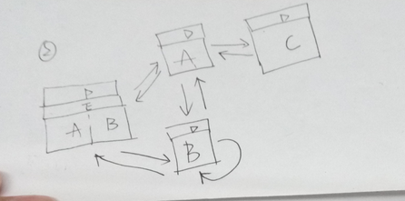

#### mwap中我的团队
三个组件，我的下属A、我的组织B、个人信息C。（我把初次的组件称为ABC，再次重新加载就加上数字表示）
首页组件：导航栏、tab栏、需要随时加载A、B、C。
默认：导航栏、tab栏、左tab是A，右tab是B。

**问题**：warning: 缺少key

解决：给每次循环加上对应的key，目的是唯一标识虚拟DOM，key来确定最少的渲染。

**问题**：为什么给listView设置1px 的底线看不见呢？

解决： 人家官方默认就是1PX，解析出来就是2px啊！

**问题**： 怎么吸顶？

解决： ListView 有三种类型的滚动容器：
1、html 的 body 容器
2、局部 div 容器 (通过 ref 获取到)
3、使用 zscroller 的模拟滚动容器
使用第二种方式，获取手机页面所有高度，减去需要吸顶的高度就是需要滚动的区域。设置这个滚动的区域高度为滚动高度。

	  let head1 = 0
        if(document.querySelectorAll('.am-navbar.am-navbar-light')[0]) {
            head1 = document.querySelectorAll('.am-navbar.am-navbar-light')[0].clientHeight;
        }
        let head2 = 0;
        if(document.querySelectorAll('.am-tabs-bar')[0]) {
            head2 = document.querySelectorAll('.am-tabs-bar')[0].clientHeight;
        }
        let h = document.body.clientHeight - head2 - head1;
        this.setState({height: h});

**问题**：listview初次加载，data为空报错。

    const dataData = (pIndex = 0) => {
    const dataBlob = {};
    for(let i = 0; i<NUM_ROWS; i++) {
        const ii = (pIndex * NUM_ROWS) + i;
        dataBlob[`${ii}`] = `row - ${ii}`;
    }
    return dataBlob;
	}
	dataArr = dataData();
	const dataSource = new ListView.DataSource({
	    rowHasChanged: (row1, row2) => row1 !== row2,
	});
	class ListComponent extends Component {
	    constructor(props) {
	        super(props);
	        this.state = {
	            dataSource: dataSource.cloneWithRows(dataArr),
	            ds: dataSource,
	            rData : dataData(),
	            isLoading: '',
	            data: data0,
	            height: '',
	            isSearch: false,
	            refreshing: false,
	        };
	        ...
	}
	
在DataSource中设置dataArr
**问题**:iphone手机路径中含有中文字符不跳转
解决：编码解码

    //编码
	getLast(aid, aname) {
		let n = encodeURI(aname);
		location.hash=`myteam/org?orgid=${aid}&name=${n}`;		
	}
	//解码
	let name = hash.match(/(name\=)(.*?)(?=&)/g)[0].split('=')[1];
    name = decodeURI(name);

**业务问题：**
**问题1**：怎么返回？
解决：
	主要是B加载B1或者A1复杂。所以在这块，只要是B需要加载自己（即B1）或者B加载A，发生了点击事件，就把当前id和name压栈到两个数组。
	返回时：无论有没有走到C组件这一步，都会让C组件隐藏。然后根据变量，判断是A还是B。如果是A，让A组件隐藏，开始出栈 ，出栈继续刷B。直到栈为空，就回到最开始的首页状态。
	
**问题2**：后来才发现我实现的功能忘记做C-A1的状态，即某个人还有下属需要查看这个人的下属列表。之前做的到C组件就停止，现在需要继续循环AC。使用变量控制的方法实现不了。

思路二（如上图）：高人指点让我使用路由。果然很简单，只需要把参数带到路由？后，在组件中解析再去请求AJAX，填数据。返回由history.go(-1)就可以回到上一个页面，而不用管A的上一个页面到底是A、C还是B。
**问题**：在手风琴组件中，上一个页面被点开的状态，history.go(-1)返回之后不能保留，用户还得再点开，这样很不人性。
解决：每次返回的时候，传参回去。如何传参呢，使用localStorage。获取当前路径中的orgid，也恰巧是前一个页面需要展开的那一项的标识。是这样的：

    <Accordion defaultActiveKey={this.state.myactiveKey} style={{ height: this.state.height,position: 'relative'}}>
		{newArr}
	</Accordion>

返回前setItem。在新页面getItem，设置展开项`defaultActiveKey`，看起来像是最后一次点过的样子。
#### 我的审批遇到的问题
由于也会两个tab页签，而且长得基本一模一样。我最开始做的是

    

		<Tabs defaultActiveKey="1" onChange={this.callback} style={{overflow: 'auto'}}>
			<TabPane tab="待我审批的" key="1">
				

					<ListComponent list={{tab:this.state.tabOne}} />
				

			</TabPane>
			<TabPane tab="我已审批的" key="2">
				

				<ListComponent list={{tab:this.state.tabOne}} />
				

			</TabPane>
		</Tabs>
		<WhiteSpace />
	

**问题**：但是这样每次切换加载的时候，listVIew会在移除前触发所有操作，在插入DOM时触发所有操作。这样肯定不是想要的。
解决:
还是使用一个listview来实现。只需要加载一次listView。而不是和tab紧密联系

    

		<Tabs defaultActiveKey="1" onChange={this.callback} style={{overflow: 'auto'}}>
			<TabPane tab="待我审批的" key="1">
				

				

			</TabPane>
			<TabPane tab="我已审批的" key="2">
				

								
				

			</TabPane>
		</Tabs>
		<ListComponent list={{tab:this.state.tabOne}} />
		<WhiteSpace />
	

**问题**：使用同一个listView。使用了RefreshControl 下拉刷新组件之后，在tab来回切换的时候，滚动条不能回到顶部。无法使用 overflow:auto 滚动，所以无法使用 scrollTop 重新定位。而且它将数据截断，比如有10条数据只渲染8条，需要拖动鼠标才可以。

原因： ListView 有三种类型的滚动容器：
1、html 的 body 容器
2、局部 div 容器 (通过 ref 获取到)
3、使用 zscroller 的模拟滚动容器
恰巧，RefreshControl 组件使用的是第三种，比较难以确定滚动条将要到达哪里。所以必须手动让他到顶部。
解决：
在每次tab切换时，使得listview的scrollTo(0,0)

    this.refs.listview.refs.listview.refs.listviewscroll.domScroller.scroller.scrollTo(0, 0);
    //listview
		<ListView
            ref="listview"
            dataSource={this.state.dataSource}

            renderFooter={() => 

            {this.state.isLoading}
             { /*{(this.state.isLoading == 1) ? '上拉加载...' : (this.state.isLoading == 0) ? '加载完成' : '无相应记录'}*/}
            
}
            style = {{height: this.state.height}}
            renderRow={row}
            renderSeparator={separator}
            className="am-list"
            
            pageSize={4}
            scrollRenderAheadDistance={500}
            scrollEventThrottle={20}
            onScroll={() => { }}
            
            onEndReached={this.onEndReached.bind(this)}
            onEndReachedThreshold={10}
            refreshControl={<RefreshControl
                refreshing={this.state.refreshing}
                onRefresh={this.onRefresh}
            />}

**注释**：在组件中作为属性的属性 使用`{/**/}`。属性使用`/**/`或者`//`都行